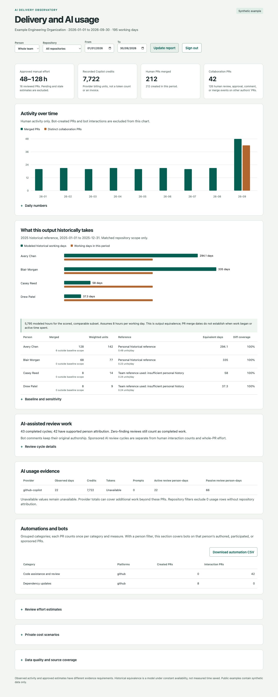

# AI Delivery Observatory

Compare engineering delivery, collaboration, AI usage, and historical work capacity
across GitHub and Bitbucket. Review per-PR effort estimates before they enter totals.
The dashboard leads with hours and activity; optional cost scenarios stay collapsed.



This is an original, MIT-licensed public reference implementation for organizations.
All committed examples are fictional. It contains no employer code, data, identities,
or internal screenshots. Historical equivalence is an estimate under stated assumptions,
not proof that AI caused a productivity change or saved those hours.

## Try the example

Python 3.11 or later is the only runtime requirement. There are no runtime dependencies.

```sh
git clone https://github.com/jcorrego/ai-delivery-observatory.git
cd ai-delivery-observatory
python3 -m observatory validate --data examples/synthetic.json --config examples/config.json
python3 -m observatory html --data examples/synthetic.json --config examples/config.json \
  --from 2026-09-01 --to 2026-09-30 --output output/demo.html
```

Open `output/demo.html` in a browser. The static export supports person filtering and
CSV downloads; its period is fixed. The [committed example](docs/demo.html) is also
self-contained. Only publish an HTML export when its full contents are cleared for sharing.

For date/repository filters and the approval UI, run the admin server on a private copy:

```sh
mkdir -p data
cp examples/synthetic.json data/demo.json
export OBSERVATORY_ADMIN_TOKEN="$(python3 -c 'import secrets; print(secrets.token_urlsafe(32))')"
python3 -m observatory serve --data data/demo.json --config examples/config.json
```

Open `http://127.0.0.1:8787` and sign in with the token stored in your environment.
For regular use, keep a separate token for each admin in a credential store. The server
binds only to loopback. See [deployment guidance](docs/deployment.md) before adapting
it for an organization. The reference server does not supply enterprise SSO or tenant isolation.

## What it does

- Collects PR metadata, file statistics, reviews, approvals, comments, and merges
  with read-only GitHub and Bitbucket Cloud API calls to explicitly listed repositories.
- Links confirmed aliases to people. Unlinked accounts appear in an admin quality
  section; bots stay outside human output and the person selector.
- Counts created and merged PRs separately. Collaboration counts distinct PRs by
  other authors; review, approval, comment, and merge events are also available separately.
- Consolidates bot aliases into code assistance/review, dependency updates,
  CI/deployment, security, and other automations. Counts each PR once per category.
- Computes monthly/daily history, fixed size weights, individual historical references,
  team fallback, diff coverage, and sensitivity to the largest baseline contributor.
- Counts sponsored AI review cycles separately from human-written interactions.
  Missing sponsorship remains unresolved; zero-finding completed reviews still count.
- Imports normalized provider usage without inventing unavailable tokens or money.
  Canonical daily totals prefer enterprise over duplicate organization records.
- Requires admin approval for effort ranges. Revision or rubric changes invalidate
  approvals. Every disposition stays in an append-only audit trail.

## Use your organization's data

Copy `examples/config.json` to `data/config.local.json`. Replace the fictional people,
confirmed aliases, observed-history boundaries, repository scope, and administrator
credential references. Review the baseline and size assumptions before reporting results.

```sh
# Tokens are references to your credential store's environment, not CLI values.
python3 -m observatory collect --platform github --repository example-org/service \
  --token-env GITHUB_READ_TOKEN --from 2025-01-01 --to 2026-09-30 --output data/github.json
python3 -m observatory collect --platform bitbucket --repository example-team/service \
  --token-env BITBUCKET_READ_TOKEN --from 2025-01-01 --to 2026-09-30 --output data/bitbucket.json
python3 -m observatory import-usage --csv data/usage.csv --output data/usage.json
python3 -m observatory merge data/github.json data/bitbucket.json data/usage.json --output data/all.json
python3 -m observatory draft-effort --data data/all.json --config data/config.local.json
python3 -m observatory serve --data data/all.json --config data/config.local.json
```

Collection can be slow for large histories. A nonzero exit and source coverage records
identify incomplete runs; file comparisons can remain unavailable without inventing
their sizes. Collection never posts comments, requests reviews, or changes provider records.

## Documentation

- [Metric definitions and formulas](docs/methodology.md)
- [Data contract and import examples](docs/data-contract.md)
- [Collector coverage and attribution](docs/collection.md)
- [Admin access and deployment](docs/deployment.md)
- [Calibration and teaching exercises](docs/teaching.md)
- [Architecture and extension points](docs/architecture.md)
- [Portfolio case study and claim boundaries](docs/case-study.md)
- [Contribution workflow](CONTRIBUTING.md)

Run `python3 -m unittest discover -s tests -v` to check the calculation, collection,
storage, CLI, and authorization contracts. The tests use synthetic fixtures and mocked
provider responses. They do not establish access to your private repositories or complete
organization billing coverage.
