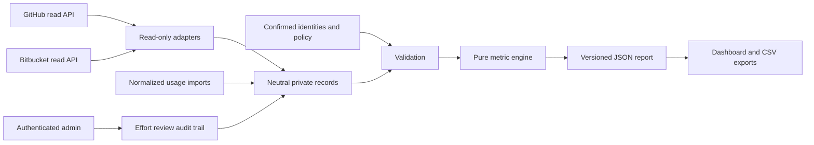

# Architecture and extension points

`model.py` validates neutral records, resolves aliases, groups automations, and applies
size policy. `metrics.py` has no network or file writes. It computes source-scoped
human activity, collaboration, usage reconciliation, references, and effort eligibility.
`providers.py` contains read-only HTTP adapters and safe pagination.

`storage.py` writes private atomic snapshots, merges stable source keys, and appends
effort dispositions. `server.py` is the loopback admin boundary. `dashboard.html`
renders reports; it does not calculate the historical model independently. `cli.py`
orchestrates collection, validation, imports, reports, static HTML, and local serving.

The same Python engine builds whole-team and person reports in static exports. The
live server additionally computes arbitrary date and repository selections. Activity,
approved effort, sponsored AI reviews, and usage follow the selected person and period.
Automation is restricted to PRs associated with that person. The fixed baseline and
team fallback remain reference context, not current-period output. Source collection
history remains admin context. A repository filter cannot silently allocate unrelated
daily AI spend.

## Add a provider

Return neutral `prs`, `events`, `ai_reviews`, and coverage/error records. Use stable
provider IDs; preserve original authorship. Complete file statistics require complete
pagination, not the first page. Missing merge timestamps must remain unknown.
Unit-test representative metadata, denied details, duplicate pagination, and attribution
before enabling the adapter against real data. Do not couple vendor payloads to charts.

## Add a metric

Define its numerator, denominator, period, population, missing-data behavior, and
source authority in `methodology.md`. Test a boundary that could overstate the result.
Add its evidence and version to JSON before adding it to the UI. Do not introduce a
universal AI speedup multiplier or convert arbitrary comments into labor hours.

## Versions and audit

PR revisions and rubric versions invalidate stale effort approvals. The historical
reference version hashes the policy and calculated baseline rows. Report versions
hash the resulting evidence and assumptions. These are reproducibility identifiers,
not signed attestation or tamper-proof audit logs. Preserve raw provider exports in
your own secure retention system when independent reconciliation is required.
